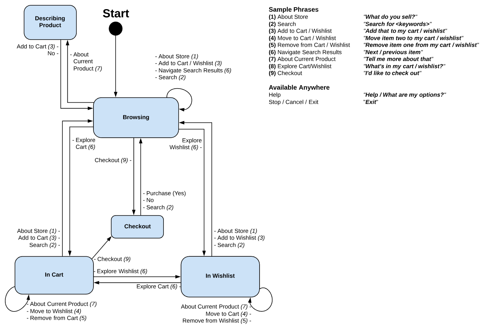

# Reference Alexa Skill Quick Start Guide

## Table of Contents

  * Reference Alexa Skill
      * [Documentation Introduction](#documentation-introduction)
  * [Overview](#overview)
  * [Setting up the Skill](#setting-up-the-skill)
      * [Prerequisites](#prerequisites)
      * [Setting up a Development Environment](#setting-up-a-development-environment)
      * [Setting up the Skill](#setting-up-the-skill)
      * [Setting up the Lambda](#setting-up-the-lambda)
  * [Project Structure](#project-structure)
  * [State Diagram](#state-diagram)
  * [Intents Reference](#intents-reference)
  * [Terms And Conditions](#terms-and-conditions)

## Reference Alexa Skill

### Documentation Introduction

This document provides guidelines to setup and configure the Reference Alexa Skill. However, this document is not a primer for JavaScript and is intended for professionals who are familiar with the following technologies:

  * [Nodejs](https://nodejs.org/en/)

## Overview

The Reference Alexa Skill is a flexible IoT skill, which communicates with Elastic Path’s RESTful e-commerce API, Cortex API. Through the Cortex API, the skill uses the e-commerce capabilities provided by Elastic Path Commerce and interacts with data in a RESTful manner.

## Setting up the Skill

### Prerequisites

Ensure that the following software are installed:

*  [Git](https://git-scm.com/downloads)
*  [Node.js](https://nodejs.org/en/download/)
* A publically available Cortex API endpoint
* A valid [Amazon Web Services (AWS) Account](https://console.aws.amazon.com)
* A valid [Amazon Developer Account](https://developer.amazon.com)

### Setting up a Development Environment

### Setting up the Skill

### Setting up the Lambda

## Project Structure

The lambda function lives under `lambda/main`.

You will find the Intent schema and all slot definitions for the skill under
`models/en-US.json`.  Refer to the ask-cli documentation for more information
about the intent schema.

## State Diagram

The Alexa skill moves between several different states, each associated with part of the shopping process. State is changed whenever a relevant intent is received. This allows us to deliver context-specific responses.

The following diagram displays all of the states, along with the basic actions you can use to navigate between each of them. Arrows indicate movement between the skill's various states, with arrows that loop back on themselves used to indicate that a given action causes the skill to remain in the current state.

_**Note:** The actions and states listed above have been named to be as human-readable as possible. The actual code for the skill uses a different set of names that are a little less immediately readable in this context. For a detailed list of the actual Intents, please see the [Intents Reference](#intents) section toward the end of this guide._

## Intents Reference

Below is a quick table of the intents the skill uses, the actions they represent, and some sample phrases you might use to trigger them. If you are relaying any errors found to the developers, it may be helpful to tell them which intent triggered the error.

For a complete list of sample phrases, check the [model file](https://github.elasticpath.net/sales-demos/alexa-vestri-store/blob/master/models/en-US.json) in the Alexa demo repository. If you're looking for alternatives, this will give you an up-to-date list of the actual samples provided to Alexa.

| Action                    | Sample Utterance                          | Intent Name                                           |
| ------------------------- | ----------------------------------------- | ----------------------------------------------------- |
| About Store               | "What do you sell?"                       | `DescribeStoreIntent`                                 |
| Search                    | "Search for {item}"                       | `KeywordSearchIntent`                                 |
| Next                      | "Next item"                               | `NextItemIntent`                                      |
| Previous                  | "Previous item"                           | `PreviousItemIntent`                                  |
| Describe Current Product  | "Tell me more about that"                 | `DescribeProductIntent` / `DescribeListedProductIntent` |
| Add to Cart               | "Add that to my cart"                     | `AddToCartIntent`                                     |
| Add to Wishlist           | "Add that to my wishlist"                 | `AddToWishlistIntent`                                 |
| Explore Cart              | "What's in my cart?"                      | `GetCartIntent`                                       |
| Explore Wishlist          | "What's in my wishlist?"                  | `GetWishlistIntent`                                   |
| Move to Wishlist          | "Move item two to my wishlist"            | `MoveToWishlistIntent`                                |
| Move to Cart              | "Move item three to my cart"              | `MoveToCartIntent`                                    |
| Remove from Cart          | "Remove item number three from my cart"   | `RemoveFromCartIntent`                                |
| Remove from Wishlist      | "Remove item number one from my wishlist" | `RemoveFromWishlistIntent`                            |
| Checkout                  | "I'd like to check out"                   | `CheckOutIntent`                                      |

In addition to these, the Alexa demo incorporates several Alexa-standard intents, which behave basically as you would expect.

| Action                    | Sample Utterance                          | Intent Name                                           |
| ------------------------- | ----------------------------------------- | ----------------------------------------------------- |
| Yes                       | "Yes"                                     | `AMAZON.YesIntent`                                    |
| No                        | "No"                                      | `AMAZON.NoIntent`                                     |
| Help                      | "Help / What are my options?"             | `AMAZON.HelpIntent`                                   |
| Exit                      | "Alexa, stop / exit"                      | `AMAZON.StopIntent`                                   |
| Cancel                    | "Cancel"*                                 | `AMAZON.CancelIntent`                                 |

*__*NOTE:*__ The Alexa Demo treats "Cancel" and "Stop" as the same. i.e., saying "cancel" will cause the skill to exit.

## Terms And Conditions

- Any changes to this project must be reviewed and approved by the repository owner. For more information about contributing, see the [Contribution Guide](https://github.com/elasticpath/alexa-skill/blob/master/.github/CONTRIBUTING.md).
- For more information about the license, see [GPLv3 License](https://github.com/elasticpath/alexa-skill/blob/master/LICENSE).
